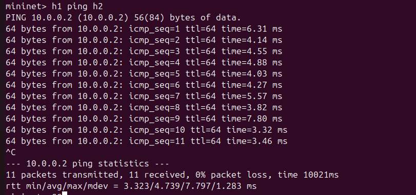
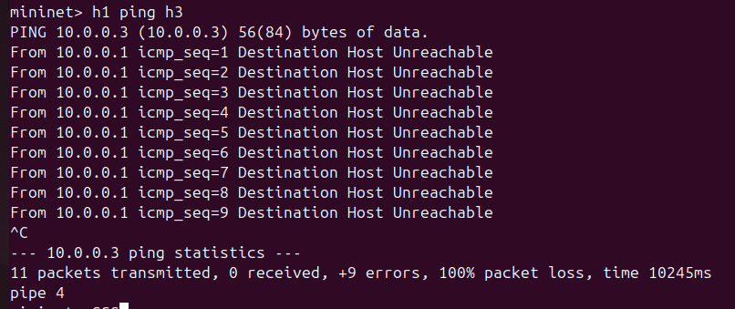
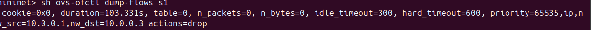
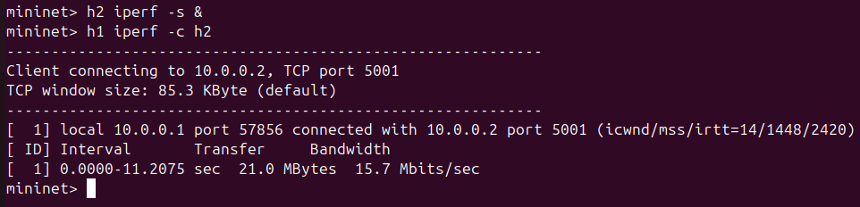
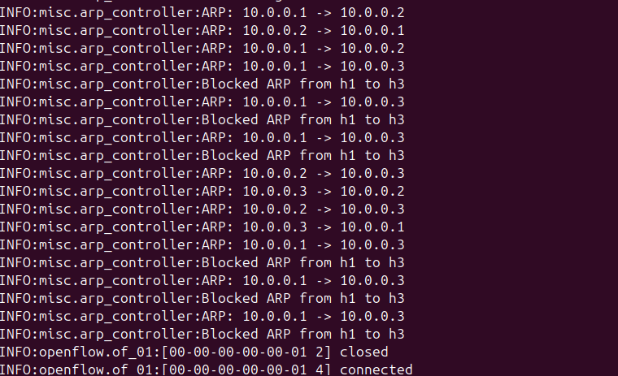

# SDN ARP Handling using POX Controller

To implement a controller that handles ARP requests centrally instead of broadcast. This demonstrates ARP interception, response generation, and flow rule enforcement.

---

## Implementation

Hosts (3 hosts) are connected to a single switch. When a host sends an ARP request, the switch forwards it to the controller instead of broadcasting.

The controller:

* Learns IP–MAC mapping
* Allows communication between h1 and h2
* Blocks communication between h1 and h3
* Installs flow rules

---

## Design Choice

A single-switch star topology is used to clearly demonstrate centralized ARP handling.

---

## Controller–Switch Interaction

When no rule is found, the switch sends a `packet_in` to the controller.
The controller processes it and installs flow rules.

---

## Controller Logic

* Receive ARP request
* Extract source/destination IP
* Apply match–action logic
* Install flow rule (forward or drop)

---

## Steps to Run

### Start Controller

```bash id="1"
cd ~/pox
./pox.py log.level --DEBUG openflow.of_01 arp_controller
```

---

### Start Mininet

```bash id="2"
sudo mn --topo single,3 --controller=remote,ip=127.0.0.1,port=6633
```

---

## Execution & Results

---

### Controller Execution

```bash id="3"
./pox.py log.level --DEBUG openflow.of_01 arp_controller
```


**Observation:** Controller starts and listens for connections.

---

### Topology Verification

```bash id="4"
net
```


**Observation:** h1, h2, h3 connected to switch s1.

---

### Case 1: Allowed Communication (h1 → h2)

```bash id="5"
h1 ping h2
```



**Observation:** Ping is successful.

---

### Case 2: Blocked Communication (h1 → h3)

```bash id="6"
h1 ping h3
```



**Observation:** Ping fails due to controller rule.

---

### Flow Table Verification

```bash id="7"
sudo ovs-ofctl dump-flows s1 | sed 's/,/\n/g'
```



**Observation:** Drop rule is installed for h1 → h3.

---

### Performance Test

```bash id="8"
h2 iperf -s &
h1 iperf -c h2
```



**Observation:** Data transfer works between allowed hosts.

---

### Controller Logs



**Observation:** Controller processes ARP and blocks h1 → h3.

---

## Test Scenarios

* Allowed: h1 → h2
* Blocked: h1 → h3

---

## Performance Observation

* Successful ping shows low latency
* Blocked communication fails
* Flow rules enforce behavior

---

## Tools Used

* Mininet
* POX Controller
* Open vSwitch
* iperf

---

## Conclusion

This project demonstrates centralized ARP handling using SDN and enforces communication policies using flow rules.

---

## Author

Samarth P Kulkarni
